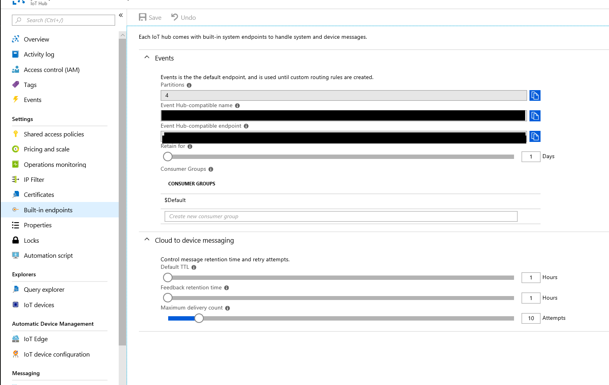

# Run End to End Tests

This document describes how to run the end to end tests.

- [Set up the test parameters](#testparams)
- [Run end to end tests on a Windows development environment](#windows_client)
- [Run end to end tests for "iothub_client" on a Linux development environment](#linux_client)

<a name="testparams"></a>
## Setup the test parameters

- Open the file "iot_device_params.txt" located under the tools\iot_hub_e2e_tests_params folders in your local copy of the repository.
- Populate the information required in this file by extracting it from the Azure portal.
    - Open the Azure IoT Hub you created in the Azure portal and navigate through "Shared Access Policies", and "iothubowner"
    
    - Locate one of the IoT Hub connection strings as shown in the figure below
    
        

    - The connection string will be in the following form: HostName=<IOTHUB_NAME>.<IOTHUB_SUFFIX>;SharedAccessKeyName=<IOTHUB_POLICY_NAME>;SharedAccessKey=<IOTHUB_POLICY_KEY>
    - Populate the following variables in the "iot_device_params.txt"  file by matching the place holders with the ones from the IoT Hub connection string shown above.
      
      - IOTHUB_CONNECTION_STRING=[entire connection string from azure portal]
     
    - Locate the Event Hub settings as shown in the figure below

    

    - Populate the following variables as described below.

      - IOTHUB_EVENTHUB_CONNECTION_STRING=Endpoint=[Event Hub-compatible endpoint];SharedAccessKeyName=[IOTHUB_POLICY_NAME];SharedAccessKey=[IOTHUB_POLICY_KEY]
      - IOTHUB_EVENTHUB_CONSUMER_GROUP=$Default
      - IOTHUB_PARTITION_COUNT=[Partition count from portal]
	  
	  Note: IOTHUB_EVENTHUB_CONSUMER_GROUP is optional. If not provided, the assumed value is "$Default".

    - Set the x509 certificate information

        The following parameters must also be provided in the configuration file:

        - IOTHUB_E2E_X509_CERT_BASE64
        - IOTHUB_E2E_X509_PRIVATE_KEY_BASE64
        - IOTHUB_E2E_X509_THUMBPRINT

        For testing-only, you can generate a x509 self-signed certificate using the following openssl command:

        ```Shell
        openssl req -x509 -newkey rsa:4096 -keyout key.pem -out cert.pem -nodes -days 365 -subj "/C=US/ST=Washington/L=Redmond/O=Company/OU=Org/CN=www.company.com"
        ```

        Note: this command generates a pass-phrase-free certificate. Protect the file!

        This will generate two files, one with the certificate information (`cert.pem`) and the other with the certificate key (`key.pem`).

        Generate Base64-encoded strings out of each file (`cert.pem` and `key.pem`) and populate IOTHUB_E2E_X509_CERT_BASE64 and IOTHUB_E2E_X509_PRIVATE_KEY_BASE64 respectively.

        Notes: 
        - There are several tools that can generate Base64-encoded strings. For example: Notepad++ with MIME Tools plugin.
        - If using the parameters on Linux, make sure newlines follow the proper style (`\n`) before doing the base64-encoding. 

        The final piece of information (IOTHUB_E2E_X509_THUMBPRINT) can be obtained using the following command:

        ```Shell
        openssl x509 -noout -fingerprint -inform pem -in cert.pem
        ```

        Note: IOTHUB_E2E_X509_THUMBPRINT takes a string with HEX characters only; make sure all colons or spaces are removed from the thumbprint. 


<a name="windows_client"></a>
## Run end to end tests on a Windows development environment

- Start the Windows PowerShell in Administrator mode. Update execution policy by entering "set-executionpolicy unrestricted"
- Navigate to azure-iot-sdk-c\cmake  
- From cmake directory, run cmake with option to enable e2e testing: Cmake -Drun_e2e_tests=ON ..
- The test directory will be located here: azure-iot-sdk-c\cmake\iothub_client\tests
- Navigate to the folder tools\iot_hub_e2e_tests_params in your local copy of the repository.
- Run the script "Set-IOTDeviceParametersForE2ETests.ps1" located under the tools\iot_hub_e2e_tests_params folders in your local copy of the repository.
- Start the Visual Studio solution "azure_iot_sdks.sln" located under the folder cmake in your home directory. 
- Build the solution
- Run the tests by Test -> Run -> All Tests menu item inside of Visual Studio.

<a name="linux_client"></a>
## Run end to end tests for "iothub_client" on a Linux development environment

- Navigate to the folder tools/iot_hub_e2e_tests_params
- Navigate to azure-iot-sdk-c\cmake
- From cmake directory run cmake with option to enable e2e testing: Cmake -Drun_e2e_tests=ON ..
- The test directory will be located here: azure-iot-sdk-c\cmake\iothub_client\tests
- Set the parameters in "iot_device_params.txt" as environment variables in the current session:
  
  Notes:
  - Make sure the contents of "iot_device_params.txt" are properly escaped for Linux (use "\$" for the '$' character).
  - Avoid using `/etc/environment` for defining these variables since it has string-size limitations (the certificate-related variables are too large).
  
  ```Shell
  set -a
  source ./iot_device_params.txt
  ```
- Navigate to the folder c/build_all/linux in your local copy of the repository.
- Run the build.sh script.
- In your home folder, in the cmake folder, run the ctest command with parameters -C "Debug"
