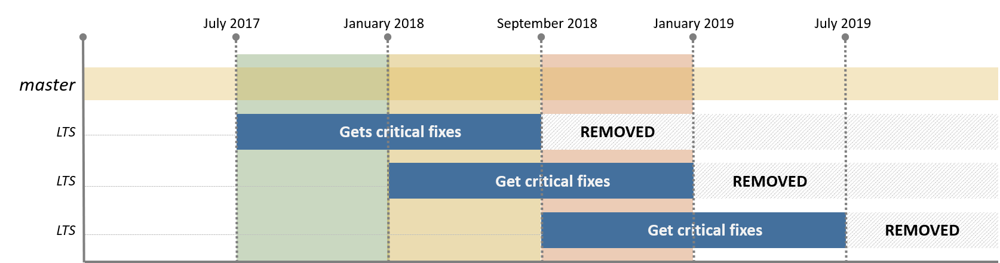

# Microsoft Azure IoT SDKs and libraries for C

This repository contains the following:
* **Microsoft Azure IoT Hub device SDK for C** to connect devices running C code to Azure IoT Hub
* **Microsoft Azure IoT Hub service SDK for C** to interface with an Azure IoT Hub service instance from a back-end C application
* **Serializer library for C** to help serialize and deserialize data on your device.

The C SDKs and library code:
* Is written in ANSI C (C99) to maximize code portability and broad platform compatibility.
* Avoids compiler extensions.
* In the device client SDK, the library exposes a platform abstraction layer to isolate OS dependencies (threading and mutual exclusion mechanisms, communications protocol e.g. HTTP). Refer to our [porting guide][c-porting-guide] for more information.

The API reference documentation for the C SDKs is [here][c-api-reference].

To find SDKs in other languages for Azure IoT, please refer to the [azure-iot-sdks][azure-iot-sdks] repository.

## Developing applications for Azure IoT

Visit [Azure IoT Dev Center][iot-dev-center] to learn more about developing applications for Azure IoT.

## How to use the Azure IoT SDKs for C

* **Using packages and libraries**: the simplest way to use the Azure IoT SDKs is to use packages and libraries when available. The following are available:
  * On Linux (Ubuntu 14.04, 15.04, 15.10, 16.04): [Device SDK on apt-get](./iothub_client/readme.md#aptgetpackage)
  * On mbed:                                      [Device SDK library on MBED](./iothub_client/readme.md#mbed)
  * On Arduino:                                   [Device SDK library in the Arduino IDE](./iothub_client/readme.md#arduino)
  * On Windows:                                   [Device SDK on NuGet](./iothub_client/readme.md#nugetpackage)
* **Clone the repository**: The repository is using [GitHub Submodules](https://git-scm.com/book/en/v2/Git-Tools-Submodules) for its dependencies. In order to automatically clone these submodules, you need to use the --recursive option as described here:
```
git clone --recursive https://github.com/Azure/azure-iot-sdk-c.git 
```
* **Compiling the source code**: when no package or library is available for your platform or if you want to modify the SDKs code, or port the SDKs to a new platform, then you can leverage the build environement provided in the repository.
  * [Device SDK](./iothub_client/readme.md#compile)
  * [Service SDK](./iothub_service_client/readme.md#compile)

## Key features and roadmap

### Device client SDK
:heavy_check_mark: feature available  :heavy_multiplication_x: feature planned but not supported  :heavy_minus_sign: no support planned

| Features                                                                                                         | mqtt                     | mqtt-ws                  | amqp                     | amqp-ws                  | https                    | Description                                                                                                                                                                                                                                                                                                       |
|------------------------------------------------------------------------------------------------------------------|--------------------------|--------------------------|--------------------------|--------------------------|--------------------------|-------------------------------------------------------------------------------------------------------------------------------------------------------------------------------------------------------------------------------------------------------------------------------------------------------------------|
| [Authentication](https://docs.microsoft.com/en-us/azure/iot-hub/iot-hub-security-deployment)                     | :heavy_check_mark:       | :heavy_check_mark:*      | :heavy_check_mark:       | :heavy_check_mark:*      | :heavy_check_mark:*      | Connect your device to IoT Hub securely with supported authentication, including private key, SASToken, X-509 Self Signed and Certificate Authority (CA) Signed.  *IoT Hub only supports X-509 CA Signed over AMQP and MQTT at the moment.                                                                        |
| [Send device-to-cloud message](https://docs.microsoft.com/en-us/azure/iot-hub/iot-hub-devguide-messages-d2c)     | :heavy_check_mark:*      | :heavy_check_mark:*      | :heavy_check_mark:*      | :heavy_check_mark:*      | :heavy_check_mark:*      | Send device-to-cloud messages (max 256KB) to IoT Hub with the option to add custom properties.  IoT Hub only supports batch send over AMQP and HTTPS only at the moment.  This SDK supports batch send over HTTP.  * Batch send over AMQP and AMQP-WS, and add system properties on D2C messages are in progress. |
| [Receive cloud-to-device messages](https://docs.microsoft.com/en-us/azure/iot-hub/iot-hub-devguide-messages-c2d) | :heavy_check_mark:*      | :heavy_check_mark:*      | :heavy_check_mark:       | :heavy_check_mark:       | :heavy_check_mark:       | Receive cloud-to-device messages and read associated custom and system properties from IoT Hub, with the option to complete/reject/abandon C2D messages.  *IoT Hub supports the option to complete/reject/abandon C2D messages over HTTPS and AMQP only at the moment.                                            |
| [Device Twins](https://docs.microsoft.com/en-us/azure/iot-hub/iot-hub-devguide-device-twins)                     | :heavy_check_mark:*      | :heavy_check_mark:*      | :heavy_check_mark:*      | :heavy_check_mark:*      | :heavy_minus_sign:       | IoT Hub persists a device twin for each device that you connect to IoT Hub.  The device can perform operations like get twin tags, subscribe to desired properties.  *Send reported properties version and desired properties version are in progress.                                                            |
| [Direct Methods](https://docs.microsoft.com/en-us/azure/iot-hub/iot-hub-devguide-direct-methods)                 | :heavy_check_mark:       | :heavy_check_mark:       | :heavy_check_mark:       | :heavy_check_mark:       | :heavy_minus_sign:       | IoT Hub gives you the ability to invoke direct methods on devices from the cloud.  The SDK supports handler for method specific and generic operation.                                                                                                                                                            |
| [Upload file to Blob](https://docs.microsoft.com/en-us/azure/iot-hub/iot-hub-devguide-file-upload)               | :heavy_minus_sign:       | :heavy_minus_sign:       | :heavy_minus_sign:       | :heavy_minus_sign:       | :heavy_check_mark:       | A device can initiate a file upload and notifies IoT Hub when the upload is complete.   File upload requires HTTPS connection, but can be initiated from client using any protocol for other operations.                                                                                                          |
| [Connection Status and Error reporting](https://docs.microsoft.com/en-us/rest/api/iothub/common-error-codes)     | :heavy_multiplication_x: | :heavy_multiplication_x: | :heavy_multiplication_x: | :heavy_multiplication_x: | :heavy_multiplication_x: | Error reporting for IoT Hub supported error code.                                                                                                                                                                                                                                                                 |
| Retry policies                                                                                                   | :heavy_multiplication_x: | :heavy_multiplication_x: | :heavy_check_mark:       | :heavy_check_mark:       | :heavy_multiplication_x: | Retry policy for unsuccessful device-to-cloud messages have three options: no try, exponential backoff with jitter (default) and custom.                                                                                                                                                                          |
| Devices multiplexing over single connection                                                                      | :heavy_minus_sign:       | :heavy_minus_sign:       | :heavy_check_mark:       | :heavy_check_mark:       | :heavy_check_mark:       |                                                                                                                                                                                                                                                                                                                   |
| Connection Pooling - Specifying number of connections                                                            | :heavy_minus_sign:       | :heavy_minus_sign:       | :heavy_multiplication_x: | :heavy_multiplication_x: | :heavy_multiplication_x: |                                                                                                                                                                                                                                                                                                                   |

### Service client SDK
:heavy_check_mark: feature available  :heavy_multiplication_x: feature planned but not supported  :heavy_minus_sign: no support planned

| Features                                                                                                      | C                  | Description                                                                                                                        |
|---------------------------------------------------------------------------------------------------------------|--------------------|------------------------------------------------------------------------------------------------------------------------------------|
| [Identity registry (CRUD)](https://docs.microsoft.com/en-us/azure/iot-hub/iot-hub-devguide-identity-registry) | :x:                | Use your backend app to perform CRUD operation for individual device or in bulk.                                                   |
| [Cloud-to-device messaging](https://docs.microsoft.com/en-us/azure/iot-hub/iot-hub-devguide-messages-c2d)     | :heavy_check_mark: | Use your backend app to send cloud-to-device messages in AMQP and AMQP-WS, and set up cloud-to-device message receivers.           |
| [Direct Methods operations](https://docs.microsoft.com/en-us/azure/iot-hub/iot-hub-devguide-direct-methods)   | :heavy_check_mark: | Use your backend app to invoke direct method on device.                                                                            |
| [Device Twins operations](https://docs.microsoft.com/en-us/azure/iot-hub/iot-hub-devguide-device-twins)       | :heavy_check_mark: | Use your backend app to perform device twin operations.  *Twin reported property update callback and replace twin are in progress. |
| [Query](https://docs.microsoft.com/en-us/azure/iot-hub/iot-hub-devguide-query-language)                       | :heavy_check_mark: | Use your backend app to perform query for information.                                                                             |
| [Jobs](https://docs.microsoft.com/en-us/azure/iot-hub/iot-hub-devguide-jobs)                                  | :x:                | Use your backend app to perform job operation.                                                                                     |
| [File Upload](https://docs.microsoft.com/en-us/azure/iot-hub/iot-hub-devguide-file-upload)                    | :x:                | Set up your backend app to send file upload notification receiver.                                                                 |

## Samples

In the repository, you will find a set of simple samples that will help you get started:
* [Device SDK samples](./iothub_client/samples/)
* [Service SDK samples](./iothub_service_client/samples/)
* [Serializer library samples](./serializer/samples/)

## OS platforms and hardware compatibility

The IoT Hub device SDK for C can be used with a broad range of OS platforms and devices:
[INCLUDE A LIST OF PLATFORMS SUPPORTED BY C OUT OF BOX]

The minimum requirements are for the device platform to support the following:

- **Being capable of establishing an IP connection**: only IP-capable devices can communicate directly with Azure IoT Hub.
- **Support TLS**: required to establish a secure communication channel with Azure IoT Hub.
- **Support SHA-256** (optional): necessary to generate the secure token for authenticating the device with the service. Different authentication methods are available and not all require SHA-256.
- **Have a Real Time Clock or implement code to connect to an NTP server**: necessary for both establishing the TLS connection and generating the secure token for authentication.
- **Having at least 64KB of RAM**: the memory footprint of the SDK depends on the SDK and protocol used as well as the platform targeted. The smallest footprint is achieved targeting microcontrollers.

You can find an exhaustive list of the OS platforms the various SDKs have been tested against in the [Azure Certified for IoT device catalog](https://catalog.azureiotsuite.com/). Note that you might still be able to use the SDKs on OS and hardware platforms that are not listed on this page: all the SDKs are open sourced and designed to be portable. If you have suggestions, feedback or issues to report, refer to the Contribution and Support sections below.

## Porting the Azure IoT device client SDK for C to new platforms

The C SDK is written in ANSI C (C99) to allow for it to run on a wide range of platforms.
In the repository you will find instructions and build tools to compile and run the device client SDK for C on Linux, Windows and microcontroller platforms (refer to the links above for more information on compiling the device client for C).
If you are considering porting the device client SDK for C to a new platform, check out the [porting guide](https://github.com/Azure/azure-c-shared-utility/blob/master/devdoc/porting_guide.md) document.

## Contribution, feedback and issues

If you encounter any bugs, have suggestions for new features or if you would like to become an active contributor to this project please follow the instructions provided in the [contribution guidelines](.github/CONTRIBUTING.md).

## Support

If you are having issues using one of the packages or using the Azure IoT Hub service that go beyond simple bug fixes or help requests that would be dealt within the issues section of this project, the Microsoft Customer Support team will try and help out on a best effort basis.
To engage Microsoft support, you can create a support ticket directly from the [Azure portal](https://ms.portal.azure.com/#blade/Microsoft_Azure_Support/HelpAndSupportBlade).
Escalated support requests for Azure IoT Hub SDKs development questions will only be available Monday thru Friday during normal coverage hours of 6 a.m. to 6 p.m. PST.
Here is what you can expect Microsoft Support to be able to help with:
- **SDKs issues**: If you are trying to compile and run the libraries on a supported platform, the Support team will be able to assist with troubleshooting or questions related to compiler issues and communications to and from the IoT Hub.  They will also try to assist with questions related to porting to an unsupported platform, but will be limited in how much assistance can be provided.  The team will be limited with trouble-shooting the hardware device itself or drivers and or specific properties on that device. 
- **IoT Hub / Connectivity Issues**: Communication from the device client to the Azure IoT Hub service and communication from the Azure IoT Hub service to the client.  Or any other issues specifically related to the Azure IoT Hub.
- **Portal Issues**: Issues related to the portal, that includes access, security, dashboard, devices, Alarms, Usage, Settings and Actions.
- **REST/API Issues**: Using the IoT Hub REST/APIs that are documented in the [documentation](https://docs.microsoft.com/en-us/rest/api/iothub/).

## Read more

* [Azure IoT Hub documentation][iot-hub-documentation]
* [Prepare your development environment to use the Azure IoT device SDK for C][devbox-setup]
* [Setup IoT Hub][setup-iothub]
* [Azure IoT device SDK for C tutorial][c-sdk-intro]
* [How to port the C libraries to other OS platforms](https://github.com/Azure/azure-c-shared-utility/blob/master/devdoc/porting_guide.md)
* [Cross compilation example][c-cross-compile]
* [C SDKs API reference][c-api-reference]

## SDK folder structure

### /c-utility, /uamqp, /umqtt, /parson

These are git submodules that contain code, such as adapters and protocol implementations, shared with other projects. Note that some of them contain nested submodules.

### /blob

This folder contains client components that enable access to Azure blob storage.

### /dps_client

This folder contains client library for device provisioning service.

### /certs

Contains certificates needed to communicate with Azure IoT Hub.

### /doc

This folder contains application development guides and device setup instructions.

### /build_all

This folder contains platform-specific build scripts for the client libraries and dependent components.

### /iothub_client

Contains Azure IoT Hub client components that provide the raw messaging capabilities of the library. Refer to the API documentation and samples for information on how to use it.

   * build: has one subfolder for each platform (e.g. Windows, Linux, Mbed). Contains makefiles, batch files, and solutions that are used to generate the library binaries.
   * devdoc: contains requirements, designs notes, manuals.
   * inc: public include files.
   * src: client libraries source files.
   * samples: contains simple samples.
   * tests: unit and end-to-end tests for source code.

### /serializer

Contains libraries that provide modeling and JSON serialization capabilities on top of the raw messaging library. These libraries facilitate uploading structured data and command and control for use with Azure IoT services. Refer to the API documentation and samples for information on how to use it.

   * build: has one subfolder for each platform (e.g. Windows, Linux, Mbed). Contains makefiles, batch files, and solutions that are used to generate the library binaries.
   * devdoc: contains requirements, designs notes, manuals.
   * inc: public include files.
   * src: client libraries source files.
   * samples: contains simple samples.
   * tests: unit tests and end-to-end tests for source code.

### /iothub_service_client

Contains libraries that enable interactions with the IoT Hub service to perform operations such as sending messages to devices and managing the device identity registry.

### /testtools

Contains tools that are currently used in testing the client libraries: Mocking Framework (micromock), Generic Test Runner (CTest), Unit Test Project Template, etc.

### /tools

Miscellaneous tools: compilembed, mbed_build, traceabilitytool (checks spec requirements vs code implementation).

# Long Term Support

The project offers a Long Term Support (LTS) version to allow users that do not need the latest features to be shielded from unwanted changes.

A new LTS version will be created every 6 months. The lifetime of an LTS branch is currently planned for one year. LTS branches receive all bug fixes that fall in one of these categories:

- security bugfixes
- critical bugfixes (crashes, memory leaks, etc.)

No new features or improvements will be picked up in an LTS branch.

LTS branches are named lts_*mm*_*yyyy*, where *mm* and *yyyy* are the month and year when the branch was created. An example of such a branch is *lts_07_2017*.

## Schedule<sup>1</sup>

Below is a table showing the mapping of the LTS branches to the packages released

| Package | Github Branch | LTS Status | LTS Start Date | Maintenance End Date | Removed Date |
| :-----------: | :-----------: | :--------: | :------------: | :------------------: | :----------: |
| 1.x.x         | lts_07_2017   | Active     | 2017-07-01     | 2017-12-31           | 2018-06-30   |

* <sup>1</sup> All scheduled dates are subject to change by the Azure IoT SDK team.

### Planned Release Schedule


---
This project has adopted the [Microsoft Open Source Code of Conduct](https://opensource.microsoft.com/codeofconduct/). For more information see the [Code of Conduct FAQ](https://opensource.microsoft.com/codeofconduct/faq/) or contact [opencode@microsoft.com](mailto:opencode@microsoft.com) with any additional questions or comments.

[iot-dev-center]: http://azure.com/iotdev
[iot-hub-documentation]: https://docs.microsoft.com/en-us/azure/iot-hub/
[devbox-setup]: doc/devbox_setup.md
[setup-iothub]: https://aka.ms/howtocreateazureiothub
[c-sdk-intro]: https://azure.microsoft.com/documentation/articles/iot-hub-device-sdk-c-intro/
[c-porting-guide]: https://github.com/Azure/azure-c-shared-utility/blob/master/devdoc/porting_guide.md
[c-cross-compile]: doc/SDK_cross_compile_example.md
[c-api-reference]: https://azure.github.io/azure-iot-sdk-c/index.html
[azure-iot-sdks]:https://github.com/azure/azure-iot-sdks
